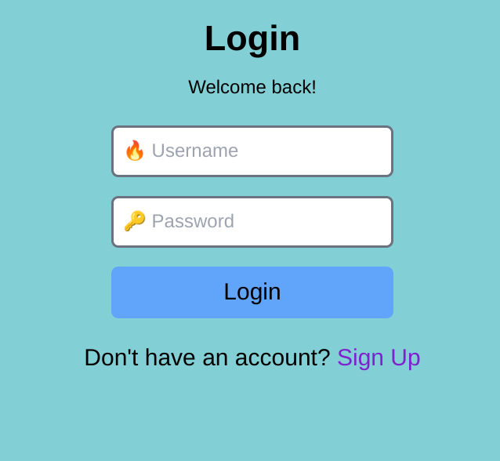
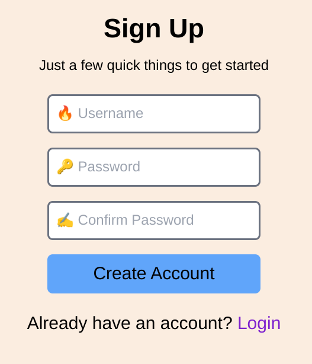
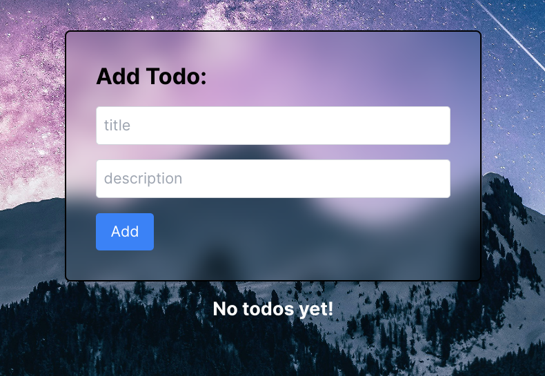
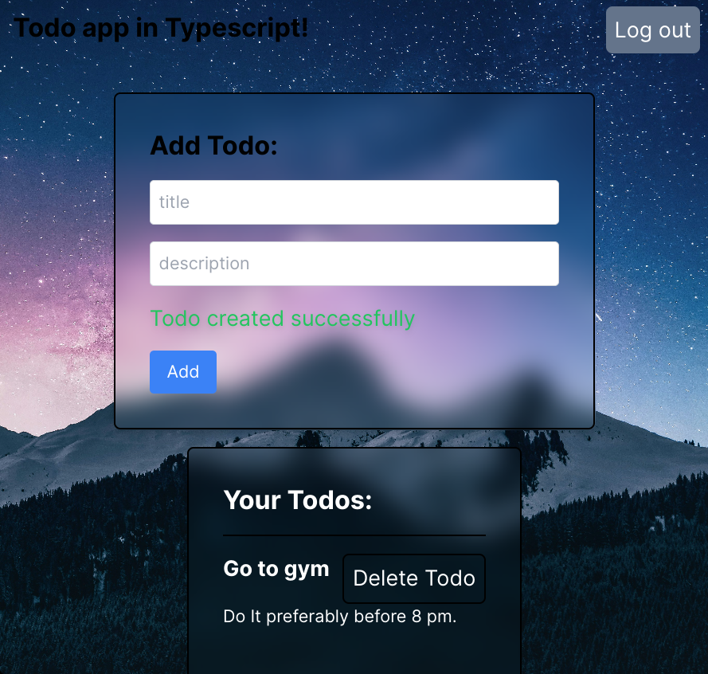

# TypeScript Todo Application

This is a simple todo application built with TypeScript. The purpose of this project is to learn TypeScript and explore the integration of various technologies.

## Features

- Create, read, update, and delete todos
- Mark todos as completed
- Filter todos by status (completed or active)

## Technologies Used

### Backend

- [Express](https://expressjs.com/) - Fast, unopinionated, minimalist web framework for Node.js
- [Prisma](https://www.prisma.io/) - Modern database toolkit for TypeScript and Node.js
- PostgreSQL - Relational database management system

### Frontend

- [Axios](https://axios-http.com/) - Promise-based HTTP client for the browser and Node.js
- [Recoil](https://recoiljs.org/) - State management library for React
- [React Router DOM](https://reactrouter.com/web/guides/quick-start) - Declarative routing for React

## Preview

## Getting Started

### Prerequisites

- Node.js and npm installed on your machine
- PostgreSQL database setup

### Backend Setup

1. Clone the repository: `git clone https://github.com/your-username/todo-app.git`
2. Navigate to the backend directory: `cd todo-app/backend`
3. Install dependencies: `npm install`
4. Create a `.env` file and configure the database connection
5. Run database migrations: `npx prisma migrate dev`
6. Start the backend server: `npm start`

### Frontend Setup

1. Navigate to the frontend directory: `cd todo-app/frontend`
2. Install dependencies: `npm install`
3. Update the API base URL in `src/api/config.ts` to match your backend server
4. Start the frontend development server: `npm start`

## Contributing

Contributions are welcome! If you find any issues or have suggestions for improvements, please open an issue or submit a pull request.

## License

This project is licensed under the [MIT License](LICENSE).
